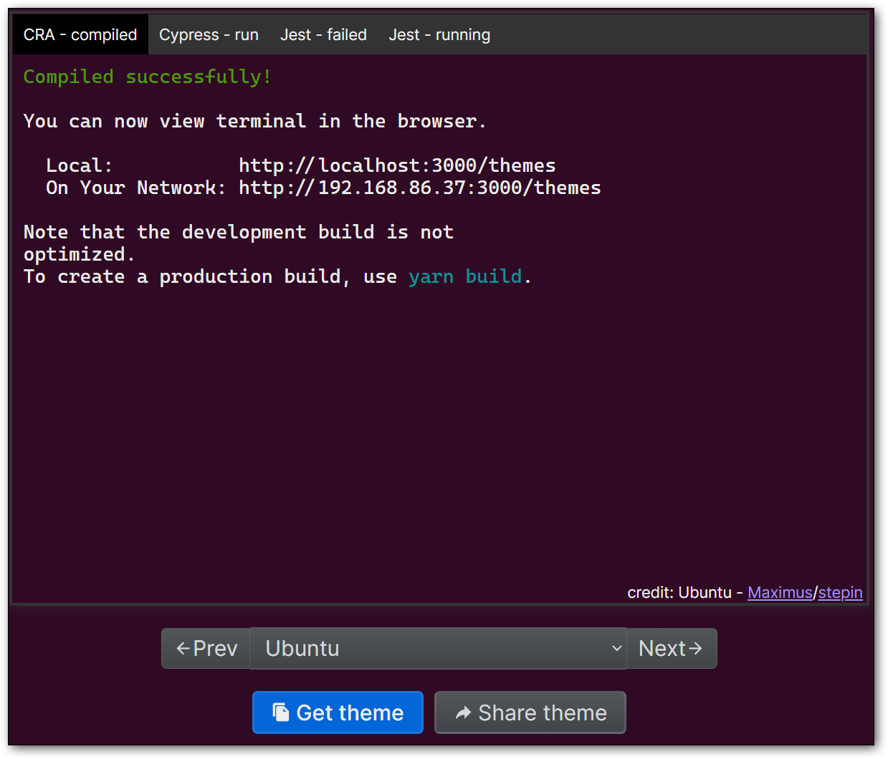

# Windows Terminal Configuration

 
## Color Themes
There are many awesome terminal themes to be found online

You can quickly add new themes to your Windows Terminal settings by:
1. Opening Settings (CTRL+,)
2. Click `Open JSON Settings File` button (at the bottom of the setting window)

    

The [Windows Terminal Themes](https://windowsterminalthemes.dev/) site has an [Ubuntu theme](https://windowsterminalthemes.dev/?theme=Ubuntu) that is great for running Ubuntu in [Windows Subsystem for Linux](https://docs.microsoft.com/en-us/windows/wsl/)

1. Find the theme you like on the [Windows Terminal Themes](https://windowsterminalthemes.dev/) site
2. The "Get theme" button copies the JSON to the clipboard
3. Paste in "schemes" section of JSON Settings file

   

